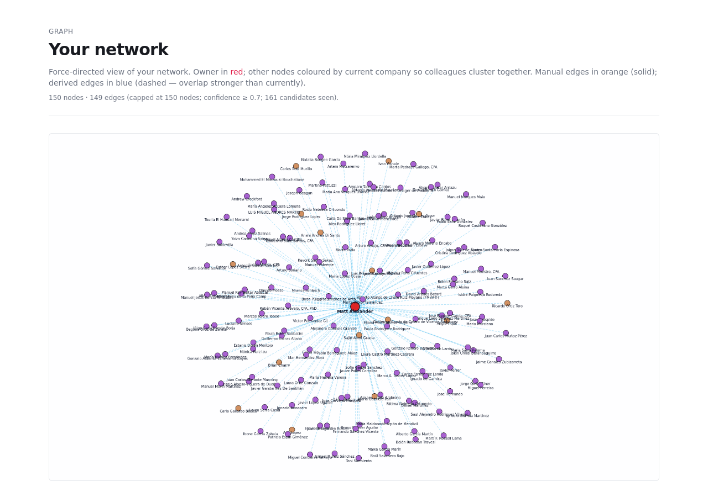
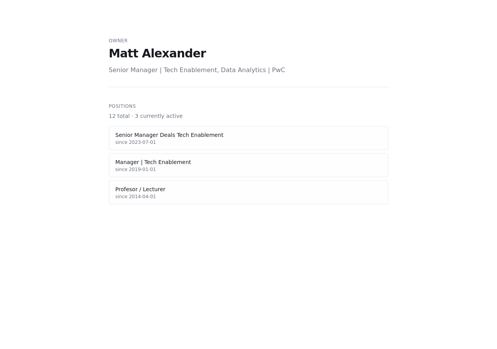
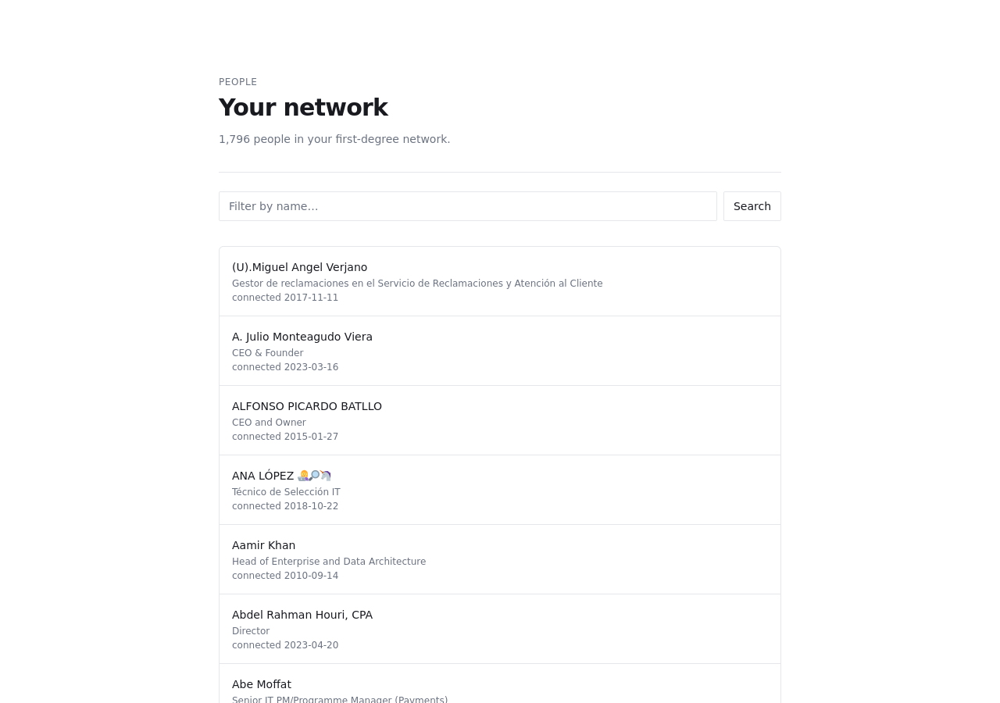
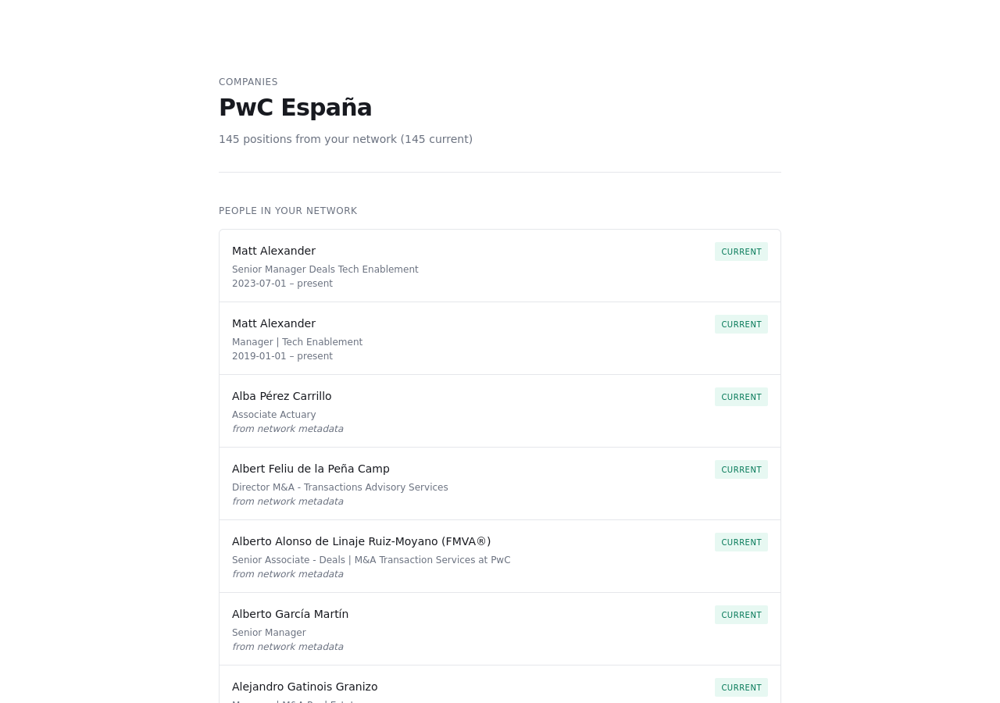
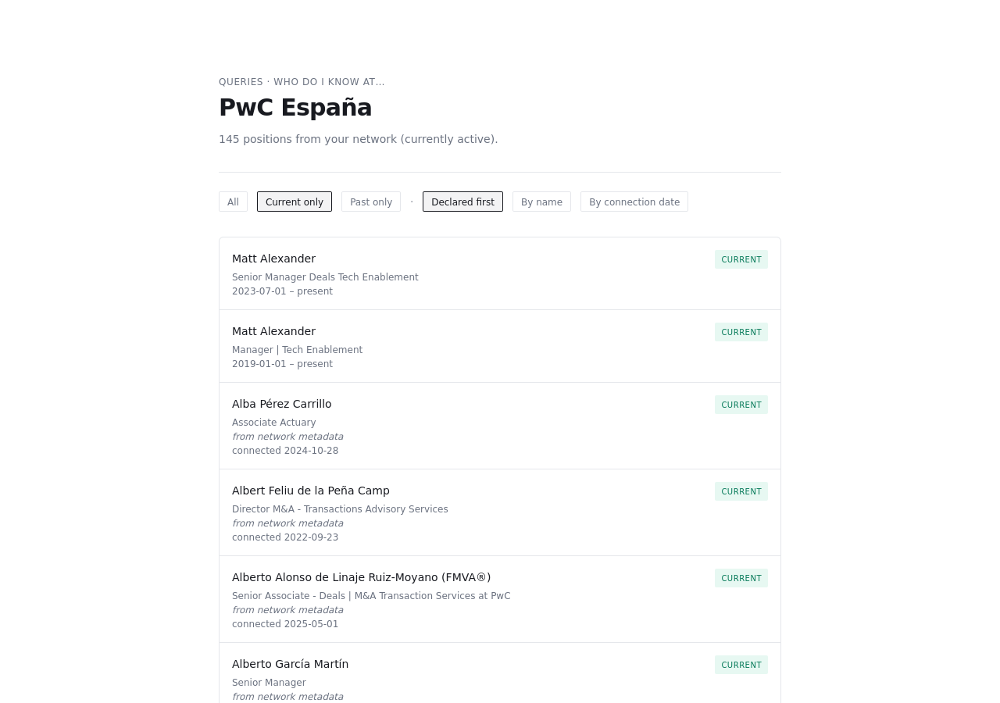
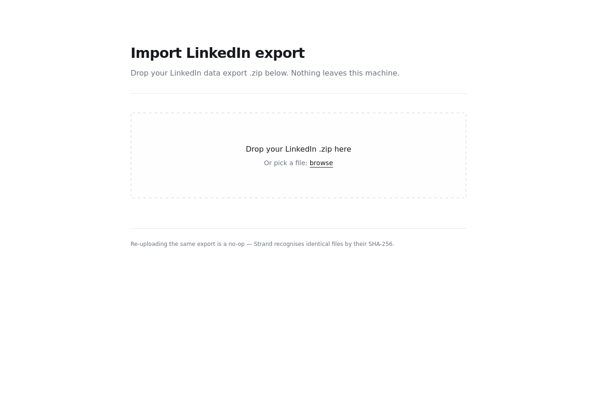

# Strand

> Your professional network, your data. Self-hostable. Local-first.

Strand ingests your LinkedIn data export and lets you query your professional
network — who you know at X, who has worked with whom, who is closest to
person Y, what your network looks like as a graph — without anything leaving
your machine.

**Status:** v0.1.0-pre — every feature week (W1–W6) shipped; W7 is the
release polish in flight. **License:** MIT.



## Why this exists

LinkedIn lets you see your network through its UI, on its terms. Strand is the
opposite posture: your network sits in one SQLite file on your machine, and
you query it however you like — through the web UI, through saved query
bookmarks, or by opening the file in any SQLite tool.

## The load-bearing constraint

The LinkedIn data export contains your **first-degree connections only**. It
does **not** export how those connections are connected to each other —
LinkedIn has never exposed the second-degree graph and almost certainly never
will.

Strand derives second-degree signal from what it *can* see and is honest
about the strength of that signal. Three kinds of derived edge land in the
`derived_edges` table, each with its own `confidence` score and an
`evidence_json` payload you can inspect:

| Kind | Confidence | Meaning |
| --- | --- | --- |
| `shared_employer_overlap` | 0.7–0.9 | Both people have *declared* positions whose date intervals overlap by ≥1 month — proven co-employment math. |
| `shared_employer_currently` | 0.5–0.9 | Both people are listed as currently at the same company (per LinkedIn metadata) but we don't have dates for both — concurrency now, no duration. |
| `shared_employer_no_overlap` | 0.4 | Same employer in different time windows — same team, different years. |

Confidence orders strength *within* a kind. Bucket names match the underlying
evidence regime, so a future query like `WHERE kind='shared_employer_overlap'`
returns only the date-math-proven edges, never the same-employer-now-no-dates
ones. (See `Projects/Strand/ISA.md` for the full Decisions log.)

You can also manually assert edges between two people in your network — the
"Alice and Bob were roommates" or "X and Y co-founded a startup that's not on
either profile" kind of fact. Those land in `manual_edges` with confidence
implicit = 1.0 and stay rigorously separate from derived edges in every
query and every UI section.

## Quick start (Bun)

Prereqs: [Bun](https://bun.sh) ≥ 1.3.

```bash
git clone <repo-url> strand
cd strand
bun install
bun run db:migrate     # creates data/strand.db
bun dev                # http://localhost:3000
```

## Quick start (Docker)

Prereqs: Docker.

```bash
docker build -t strand .
docker run -p 3000:3000 -v "$(pwd)/data:/app/data" strand
```

The `data/` volume holds your SQLite database — bind-mount it so your data
survives container restarts and stays on your filesystem.

## Loading your LinkedIn export

1. Request your data export at
   [linkedin.com/psettings/member-data](https://www.linkedin.com/psettings/member-data) —
   it arrives by email within ~24 hours.
2. Open Strand at `http://localhost:3000/upload`.
3. Drag the `.zip` onto the drop zone.

Re-uploading the same export is idempotent (sha256-deduped at the batch
level). The bytes are parsed in-memory and **never persisted to disk** — only
the parsed rows land in SQLite. Confirmed by the W4 verification suite:
`find data/ -name '*.csv'` returns zero files after ingest.

## Feature tour

### `/profile` — your owner identity from `Profile.csv`



Shows your name, headline, and your *declared* positions (from
`Positions.csv`, with real start/end dates). Synthesised positions
from connection metadata never appear here.

### `/people` — your first-degree network



Paginated, filterable by name. Click into anyone for their detail page
(positions, manual edges, derived edges).

### `/companies/[id]` — everyone in your network at company X



The "who do I know at X" workhorse. Distinguishes declared positions (your
own, with dates) from positions synthesised from connection metadata (your
network's current employers, dates unknown).

### `/queries/at-company` — the same view, saveable



Same data as the company detail page, but as a query surface: filter by
status (`current` / `past`), sort (`declared-first` / `name` / `connected`),
and bookmark the resulting URL.

### `/queries/worked-with/[id]` — manual + derived edges incident to X

Two rigorously separate sections: manually-asserted facts vs. inferred
overlaps. Different epistemics, different sections, different code paths.
Never merged into a single "edges" list.

### `/queries/by-year` — connections by year histogram

Bucket your connections by the year you connected. Click a year to see that
cohort. Unknown bucket for connections whose LinkedIn-export date is null.

### `/queries/reach/[id]` — strongest reach to a target

For target X, ranked list of intermediaries Y in your network who could
introduce, vouch, or co-introduce. Score: `1.0` for any manual edge `(Y, X)`,
else `max(derived.confidence)` over `(Y, X)` edges. Manual ranks above
derived; tied derived broken by overlap-months desc.

### `/graph` — Cytoscape force-directed view


Owner-centric force-directed network. Owner in red and larger; other nodes
coloured by current-employer hash so colleagues cluster together. Manual
edges in solid orange; derived edges in blue (overlap deep, currently
lighter). Capped at 150 nodes for readability.

### `/upload` — the entry point



## Architecture

```
LinkedIn .zip ─┐
               │  multipart upload
               ▼
       /api/ingest/linkedin
               │  JSZip → parse → INSERT OR IGNORE
               ▼
       data/strand.db (SQLite via @libsql/client + Drizzle)
               │
               ├─ tenants         (one row: 'local' in self-host mode)
               ├─ people          (you + your connections)
               ├─ companies       (normalized; placeholders filtered)
               ├─ positions       (declared from Positions.csv | synthesised from Connections.company)
               ├─ connections     (1st-degree edges from you)
               ├─ manual_edges    (owner-asserted facts)
               └─ derived_edges   (inferred, 3 kinds + confidence)
                         │
                         │  derive job runs at end of ingest
                         │  + on-demand: POST /api/derive
                         ▼
                   Next.js App Router pages
                         │  (server components query SQLite)
                         ▼
                  http://localhost:3000
```

Every entity table carries `tenant_id`, defaulted to `'local'` in self-host
mode. A future Postgres + NextAuth multi-tenant fork is a one-pass migration,
not a rewrite.

## Stack

- **Runtime:** [Bun](https://bun.sh)
- **App framework:** [Next.js 14](https://nextjs.org) (App Router) + TypeScript
- **Database:** SQLite via [`@libsql/client`](https://github.com/tursodatabase/libsql-client-ts) (pure-JS; no native build step)
- **ORM / migrations:** [Drizzle](https://orm.drizzle.team)
- **UI:** Tailwind + shadcn-style component primitives
- **Graph viz:** [Cytoscape.js](https://js.cytoscape.org) (cose layout)

## Roadmap

| Wk | Goal | Status |
| --- | --- | --- |
| W1 | Skeleton | ✅ Shipped — Next.js + Bun + SQLite + Drizzle wired. |
| W2 | Ingest | ✅ Shipped — LinkedIn `.zip` parser, drag-drop, idempotent re-import. |
| W3 | Browse | ✅ Shipped — `/people`, `/companies`, detail pages, manual edges. |
| W4 | Derive | ✅ Shipped — shared-employer detection, 3-kind taxonomy, confidence buckets. |
| W5 | Query | ✅ Shipped — `/queries/at-company`, `worked-with`, `by-year`, `reach` + saved bookmarks. |
| W6 | Visualise | ✅ Shipped — Cytoscape force-directed graph at `/graph`. |
| W7 | Polish & ship | 🚧 In flight — README, screenshots, Docker, CONTRIBUTING, v0.1.0. |

## Privacy posture

- No telemetry. No analytics. No outbound network calls in normal operation
  (verified by Playwright probes across every route — see
  `scripts/verify-w*.ts`).
- LinkedIn `.zip` bytes are parsed in memory and never written to disk —
  only the parsed rows land in SQLite.
- The `data/` directory is gitignored *and* dockerignored.
- Bookmarks (`saved_queries`) validate URLs as relative in-app paths only —
  no offsite or protocol-relative URLs are accepted.

## Development

```bash
bun run typecheck       # tsc --noEmit
bun test                # unit tests (parser + derive math)
bun run db:migrate      # apply Drizzle migrations
bun run db:studio       # Drizzle Studio against data/strand.db
bun run screenshots     # regenerate docs/screenshots/* against a running dev server
```

The integration probes and the screenshot capture use Playwright. Playwright
ships its browsers separately — run this once per machine before invoking
any `verify-w*.ts` or `screenshots`:

```bash
bun x playwright install firefox
```

Verification scripts (run against a live `bun dev` at `localhost:3000`):

```bash
bun run scripts/verify-w3.ts   # browse + manual edges
bun run scripts/verify-w4.ts   # derived edges + synthesised positions
bun run scripts/verify-w5.ts   # /queries/at-company + bookmarks
bun run scripts/verify-w5b.ts  # /queries/worked-with + by-year + reach
bun run scripts/verify-w6.ts   # /graph
```

## Contributing

See [CONTRIBUTING.md](CONTRIBUTING.md). The project's living state-of-record
is the ISA at `Projects/Strand/ISA.md` (in this repo) — it captures every
ISC, decision, and refutation across W1–W7. Read it before proposing
architectural changes.

## License

MIT. See [LICENSE](LICENSE).
